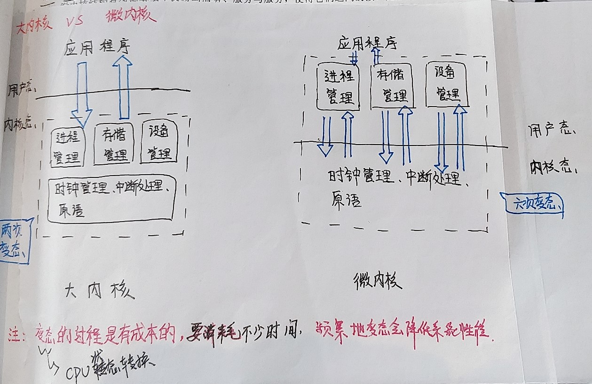

# 第四节、OS 的体系结构

## 目录

- 内核
  - 概念
  - 分类

## 一、内核

### 1. 概念

    内核是计算机上配置的底层软件，是OS最基本、最核心的部分。实现OS内核功能的程序就是内核程序。

### 2. 分类

    - 大内核
    - 微内核
    - 大内核vs微内核

#### 2.1 大内核

    指的是将OS的主要功能模块都作为系统内核，运行在内核态。
    优点：性能高。
    缺点：内核代码庞大，结构混乱，难以维护。
    例如：Linux、Unix

#### 2.2 微内核

    指的是只把最基本的功能保留在内核。移除内核那部分代码根据分层的原则被划成若干服务程序，它们的执行相互独立，借助微内核进行通信。
    优点：内核功能少，结构清晰，方便维护。
    缺点：需要频繁在核心态和用户态之间切换，性能低。
    例如：Windows NT

#### 2.3 大内核 vs 微内核

